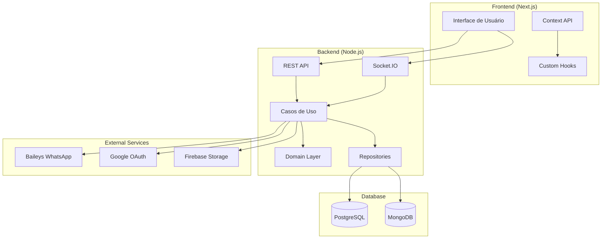

# Arquitetura do Sistema

## Estilo Arquitetural

**Monorepo com Arquitetura em Camadas + Event-Driven**

### Backend - Clean Architecture

```
src/
├── domain/           # Entidades, Value Objects, Interfaces de domínio
├── application/      # Casos de Uso, Services, DTOs
├── infrastructure/   # Repositórios, APIs externas, Database
└── presentation/     # Controllers, Routes, Middlewares
```

### Frontend - Component-Based Architecture

```
apps/frontend/
├── app/             # Pages e layouts (App Router)
├── components/      # Componentes reutilizáveis
├── contexts/        # Context API para estado global
├── hooks/           # Custom hooks
├── lib/             # Utilities e configurações
└── types/           # Definições TypeScript
```

## Diagrama de Arquitetura



## Módulos Principais

### 1. Autenticação e Autorização

- Google OAuth integration
- JWT token management
- Role-based access control
- Session management

### 2. Baileys Socket Manager

- Conexão e gerenciamento de sessões WhatsApp
- Event listeners para grupos e participantes
- QR Code generation e handling
- Message sending e receiving

### 3. Grupo e Participantes Manager

- Sincronização automática com WhatsApp
- CRUD operations para grupos
- Gestão de participantes e permissões
- Soft delete para remoções

### 4. Sistema de Mensagens Anônimas

- Queue de mensagens para aprovação
- Workflow de aprovação por admins
- Mention system para participantes
- Audit trail completo

### 5. Formulários de Participantes

- Token-based verification system
- File upload para Firebase
- Form validation com Zod
- Public access endpoints

## Decisões Arquiteturais Chave

### POO vs Functional Programming

**Decisão**: Priorizar POO e Classes
**Motivo**: Melhor encapsulamento para gerenciamento de estado do Baileys, facilita testing e dependency injection

### Database Strategy

**Decisão**: PostgreSQL + MongoDB híbrido
**Motivo**:

- PostgreSQL: Dados relacionais (usuários, grupos, tokens)
- MongoDB: Mensagens do WhatsApp (via Baileys getMessage)

### Monorepo Structure

**Decisão**: Separar apps mas compartilhar tipos
**Motivo**: Deploy independente, mas consistency de tipos entre frontend e backend

### Real-time Communication

**Decisão**: Socket.IO para eventos em tempo real
**Motivo**: QR code updates, connection status, message approvals precisam de feedback instantâneo

### State Management Frontend

**Decisão**: Context API + Custom Hooks
**Motivo**: Projeto de escala média, evita complexidade desnecessária do Redux

## Patterns e Princípios

### SOLID Principles

- **S**: Single Responsibility - Cada classe tem uma responsabilidade específica
- **O**: Open/Closed - Extensível via interfaces, fechado para modificação
- **L**: Liskov Substitution - Implementações intercambiáveis via interfaces
- **I**: Interface Segregation - Interfaces específicas por contexto
- **D**: Dependency Inversion - Injeção de dependências nas camadas superiores

### Design Patterns Utilizados

- **Repository Pattern**: Abstração da camada de dados
- **Factory Pattern**: Criação de conexões Baileys
- **Observer Pattern**: Event listeners do WhatsApp
- **Strategy Pattern**: Diferentes tipos de tokens e validações
- **Builder Pattern**: Construção de mensagens complexas

## Fluxo de Dados

### 1. Autenticação

```
Frontend → Google OAuth → Backend → JWT Generation → Database → Frontend
```

### 2. Conexão WhatsApp

```
Frontend → Socket.IO → Backend → Baileys → QR Generation → Socket.IO → Frontend
```

### 3. Sincronização de Grupos

```
Baileys Events → Backend Processing → Database Update → Socket.IO → Frontend Update
```

### 4. Mensagem Anônima

```
Frontend Form → Backend Validation → Database Queue → Admin Approval → Baileys Send → Database Update
```

## Considerações de Performance

### Backend

- Connection pooling para PostgreSQL
- Caching de dados de grupos frequentemente acessados
- Rate limiting para APIs públicas
- Batch operations para sincronização

### Frontend

- Server Components quando possível
- Lazy loading de componentes pesados
- Memoização de operações caras
- Optimistic updates para UX

### Database

- Índices apropriados para queries frequentes
- Soft delete para auditoria
- Partitioning por data quando necessário
- Backup estratégico
