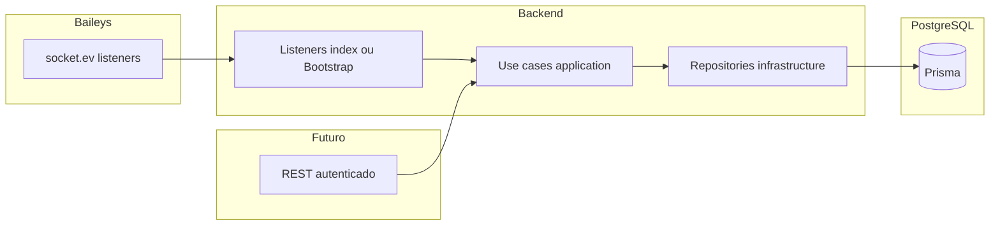

# Especificação (prompt de implementação): sincronização grupos e participantes (Baileys → PostgreSQL)

Documento reutilizável para implementação no backend e para futuras **APIs REST** (os mesmos casos de uso devem ser invocados com autenticação / RBAC, sem duplicar regra de negócio).

**Padrões estruturais do repositório:** [docs/architecture.md](../architecture.md) (camadas, monorepo) e [`.cursor/rules/node-backend.mdc`](../../.cursor/rules/node-backend.mdc) (Domain / Application / Infrastructure / Presentation, Prisma, DTOs, repositórios com queries parametrizadas).

---

## 1. Contexto e objetivos

- **Objetivo:** manter as tabelas `groups_wpp`, `participants_wpp` e `participant_group_wpp` alinhadas com o estado WhatsApp da **instância Baileys** ligada ao processo.
- **Reutilização:** casos de uso (application layer) que implementam upsert de grupo, upsert de participante, membro no grupo, saída (soft) e admin **não** devem depender de “ser evento Baileys” vs “ser pedido HTTP”. Os *listeners* Baileys e os *controllers* REST futuros apenas **orquestram** e chamam os mesmos casos de uso.
- **Referência de schema Prisma:** [apps/backend/prisma/schema.prisma](../../apps/backend/prisma/schema.prisma).

---

## 2. Decisão: fonte única para “participante entrou” (persistência)

- A persistência de **entrada de participante** deve ocorrer **apenas** quando o Baileys emitir `socket.ev` → **`group-participants.update`** com **`action: 'add'`**.
- O evento **`messages.upsert`** com **stub 27** (*participante entrou*) pode continuar a ser usado para **debug** ou outras regras, mas **não** deve escrever em `participants_wpp`, `participant_group_wpp` ou criar grupos, para evitar **duplicidade** e condições de corrida com o `group-participants.update`.
- Referência de encadeamento de callbacks: [apps/backend/src/infrastructure/services/BaileysSocketService.ts](../../apps/backend/src/infrastructure/services/BaileysSocketService.ts) (`onParticipantJoin` dispara a partir de `add` e, separadamente, de stub 27 — a implementação de sync deve filtrar na **camada de aplicação** ou não registar o handler de persistência no ramo stub 27).

---

## 3. Alteração de modelo de dados

### 3.1 `groups_wpp`

- Adicionar campo **`description`**: `String?` (nullable), mapeando a descrição do grupo nos metadados Baileys (ex. `desc` em `GroupMetadata` / equivalente no DTO interno), quando existir.
- **Passos:** editar o model `GroupsWpp` em [schema.prisma](../../apps/backend/prisma/schema.prisma), gerar **migration** PostgreSQL, `prisma generate`.
- **Domain / DTOs:** atualizar entidade [GroupWpp](../../apps/backend/src/domain/entities/GroupWpp.ts) e contratos [IGroupWppRepository](../../apps/backend/src/domain/interfaces/repositories/IGroupWppRepository.ts) (`CreateGroupWppData` / `UpdateGroupWppData`) para incluir `description`.
- **Imagem do grupo:** o callback `onGroupJoin` (alimentado por `groups.upsert`) **não** traz necessariamente a URL da imagem; obter com **`socket.profilePictureUrl(groupJid, 'image')`** (Baileys), em `try/catch`; se falhar, persistir `imageUrl` como `null` sem abortar o upsert do resto dos campos.

### 3.2 `participants_wpp` — campos `jid` e `lid`

Além de `whatsappRegistry` e `cellphone`, a tabela **`participants_wpp`** deve passar a guardar explicitamente as duas formas de identificador que o WhatsApp / Baileys usam em contexto LID:

| Campo (proposto) | Tipo | Conteúdo |
|------------------|------|----------|
| **`jid`** | `String?` | JID em formato **número (PN)**: `5511986293165@s.whatsapp.net`, o mesmo que hoje se usa como **`whatsappRegistry`** chave de negócio. Pode ser **redundante** com `whatsappRegistry`; inclui-se para consultas explícitas “JID PN” e alinhamento com a nomenclatura Baileys. Se preferires evitar duplicação, mantém só `whatsappRegistry` como PN e documenta que **equivale ao JID PN**; este campo só é necessário se quiseres colunas semanticamente distintas. |
| **`lid`** | `String?` | JID **LID** quando existir: `75655932829836@lid`, tal como em `participants[].id` nos eventos com `addressingMode: 'lid'`. Pode ser **null** se o payload não trouxer LID ou antes da primeira sincronização. |

**Regras:**

- **`whatsappRegistry`** continua a ser o identificador **único** preferencial para negócio e FKs (valor PN `...@s.whatsapp.net`), conforme §5.
- Em **upsert** de participante a partir do evento `group-participants.update`, preencher **`lid`** com `participants[].id` quando for `...@lid`, e **`jid`** com `participants[].phoneNumber` quando for `...@s.whatsapp.net` (ou o mesmo valor gravado em `whatsappRegistry`).
- Se mais tarde chegar um evento só com LID mas **sem** PN no payload, tentar resolver PN via **`groupMetadata`** (`participants[].phoneNumber`) antes de criar/atualizar o registo; **`lid`** permite correlacionar mesmo quando o PN falha temporariamente.

**Passos de implementação:** migration Prisma em `ParticipantsWpp`, atualizar entidade `ParticipantWpp` (se existir), DTOs dos repositórios de participantes e mapeamento nos casos de uso de sync.

---

## 4. Mapeamento evento Baileys → persistência

| Gatilho | Origem no código (callback / socket) | Ação de persistência |
|--------|----------------------------------------|----------------------|
| Metadados do grupo disponíveis | `onGroupJoin` ← `groups.upsert` ([BaileysSocketService](../../apps/backend/src/infrastructure/services/BaileysSocketService.ts)) | **Upsert** `groups_wpp` pela chave de negócio `whatsappRegistry = group.id` (`...@g.us`). Campos sugeridos: `name` ← `subject`, `linkedParent`, `description` ← metadados, `imageUrl` ← `profilePictureUrl` (opcional). Se já existir registo com mesmo `whatsappRegistry`, **atualizar**; senão **criar**. |
| Participante entra | `group-participants.update`, **`action: 'add'`** | Ver payloads em [add-event-data.md](./add-event-data.md), [add-event-data-notify.md](./add-event-data-notify.md), [add-event-data-metada.md](./add-event-data-metada.md). Garantir grupo (por `event.id`); se não existir em BD, obter **`groupMetadata(groupId)`** e criar/atualizar `groups_wpp`. Garantir linha em `participants_wpp` pelo **whatsappRegistry PN** (§5). **Upsert** relação em `participant_group_wpp` (§6). |
| Participante sai | **`action: 'remove'`** | [remove-event-data.md](./remove-event-data.md). **Não** apagar linha de `participant_group_wpp`. **Soft update:** `deleted = true`, `removedAt = now()`. Localizar junção por `whatsappRegistry` do grupo e do participante (§5–6). |
| Promover admin | **`action: 'promote'`** | [promote-event-data.md](./promote-event-data.md). `admin = true` em `participant_group_wpp` para o par grupo + participante. |
| Despromover admin | **`action: 'demote'`** | `admin = false` no mesmo registo de junção. |

---

## 5. Identidade: LID vs PN (JID) e convenção `cellphone`

- Com **`addressingMode: 'lid'`**, o evento referencia participantes com `id` em **`...@lid`**, mas o **identificador estável** para `participants_wpp.whatsappRegistry` deve ser o **JID PN** **`...@s.whatsapp.net`** quando existir no payload ou em `groupMetadata.participants[].phoneNumber`.
- Persistir também **`lid`** e **`jid`** conforme §3.2: assim ficas com traço auditável do par **LID / PN** que o servidor envia, útil para eventos que ainda chegam só com um dos lados.
- **Derivacao recomendada:** alinhar com a lógica de `resolvePnJidForUserQueries` em [BaileysSocketService](../../apps/backend/src/infrastructure/services/BaileysSocketService.ts) para queries ao Baileys; para **persistência**, usar sempre que possível o PN como `whatsappRegistry`.
- **`cellphone` (tabela `participants_wpp`):** guardar **apenas dígitos** do número internacional, sem `@`, sem espaços ou traços (ex.: PN `5511986293165@s.whatsapp.net` → `cellphone = "5511986293165"`). Esta convenção deve ser **única** em todo o projeto para novos inserts.

---

## 6. Regra de junção `participant_group_wpp`

- Chave lógica: par **`idGroupWpp`** + **`idParticipantWpp`** (já há `@@unique([idGroupWpp, idParticipantWpp])` no [schema](../../apps/backend/prisma/schema.prisma)).
- Resolução por WhatsApp: encontrar `GroupsWpp` por `whatsappRegistry = event.id` (JID do grupo `...@g.us`) e `ParticipantsWpp` por `whatsappRegistry` = PN do participante (`participants[].phoneNumber` no payload de remove/promote/demote; em **add**, usar PN conforme §5).
- **Participante entra (`add`):**
  - Se **não existir** registo na junção: **insert** com `admin` conforme payload se disponível, caso contrário default `false`; `deleted = false`; `removedAt = null`.
  - Se **já existir** (ex.: reentrada após saída): **atualizar** `updatedAt`, `deleted = false`, **`removedAt = null`**, e refrescar campos opcionais (`name`, `linkedParent`, `admin`) se a política do produto assim o exigir (default mínimo: reativação da membria).
- **Participante sai (`remove`):** não remover linha; **soft:** `deleted = true`, `removedAt = now()` (timezone UTC recomendado para armazenamento).

---

## 7. Arquitetura de implementação (contratos, sem código)

### 7.1 Listeners

- Registar na composição da app (ex.: [apps/backend/src/index.ts](../../apps/backend/src/index.ts)) ou classe dedicada (`WhatsAppSyncBootstrap`): subscrever `onGroupJoin`, `onParticipantJoin`, `onParticipantLeave`, `onGroupUpdate` e delegar **apenas** a casos de uso.

### 7.2 Casos de uso sugeridos (application)

| Caso de uso (nome ilustrativo) | Responsabilidade |
|-------------------------------|------------------|
| `UpsertGroupFromBaileysUseCase` | Upsert `groups_wpp` + `profilePictureUrl` opcional + `description`. |
| `EnsureParticipantAndMembershipOnJoinUseCase` | Fluxo completo do `add`: garantir grupo, participante, junção. |
| `MarkParticipantLeftInGroupUseCase` | Soft leave no `remove`. |
| `SetParticipantAdminInGroupUseCase` | `promote` / `demote` |

Dependências típicas: repositórios abstraídos por interfaces em `domain/interfaces/repositories`; opcionalmente `IBaileysSocketService` só quando for preciso chamar `groupMetadata` / `profilePictureUrl` dentro do caso de uso (alternativa: injetar apenas dados já obtidos no listener para facilitar testes).

### 7.3 Repositórios (infrastructure)

- Existe [IGroupWppRepository](../../apps/backend/src/domain/interfaces/repositories/IGroupWppRepository.ts); podem faltar interfaces/implementações Prisma para **participantes** e **participant_group_wpp**. O documento de implementação deve acrescentar métodos do tipo:
  - `findParticipantByWhatsappRegistry`, `createParticipant`, …
  - `findMembershipByGroupAndParticipantIds` ou resolução por registries com join nas duas tabelas,
  - `upsertMembership`, `softLeaveMembership`, `setAdminOnMembership`.

Queries sempre **parametrizadas** (Prisma); sem concatenar input utilizador em SQL cru.

### 7.4 REST futuro

- Rotas futuras (ex.: promover/despromover por API) devem chamar **os mesmos casos de uso**, após autenticação (JWT ou outro), **RBAC** e validação de input (tamanho, formato de JIDs), sem duplicar lógica.

---

## 8. Transações, observabilidade e falhas

- Quando **criar grupo + participante + junção** na mesma operação lógica, usar **transação Prisma** (`$transaction`) para consistência.
- **Logging:** eventos de falha em `groupMetadata`, `profilePictureUrl` ou escritas na BD devem ser registados com nível adequado; **não** logar conteúdo sensível além do necessário para diagnóstico.
- Falha ao obter imagem ou descrição **não** deve impedir upsert dos restantes campos do grupo.

---

## 9. Diagrama (visão geral)

---

## 10. Fora de âmbito desta especificação

- Implementação concreta de rotas REST, JWT ou Swagger neste momento.
- Persistência duplicada a partir de **stub 27** em `messages.upsert` (§2).

---

## 11. Verificação com exemplos guardados

Antes de codificar, confrontar os nomes de propriedades dos payloads reais com:

- [remove-event-data.md](./remove-event-data.md)
- [promote-event-data.md](./promote-event-data.md)
- [add-event-data.md](./add-event-data.md), [add-event-data-notify.md](./add-event-data-notify.md), [add-event-data-metada.md](./add-event-data-metada.md)

Se o WhatsApp alterar o formato entre versões Baileys, atualizar estes ficheiros e ajustar apenas o **mapeamento** na camada de infraestrutura / DTO de entrada dos casos de uso.
